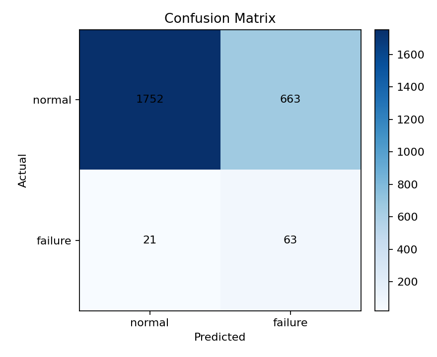
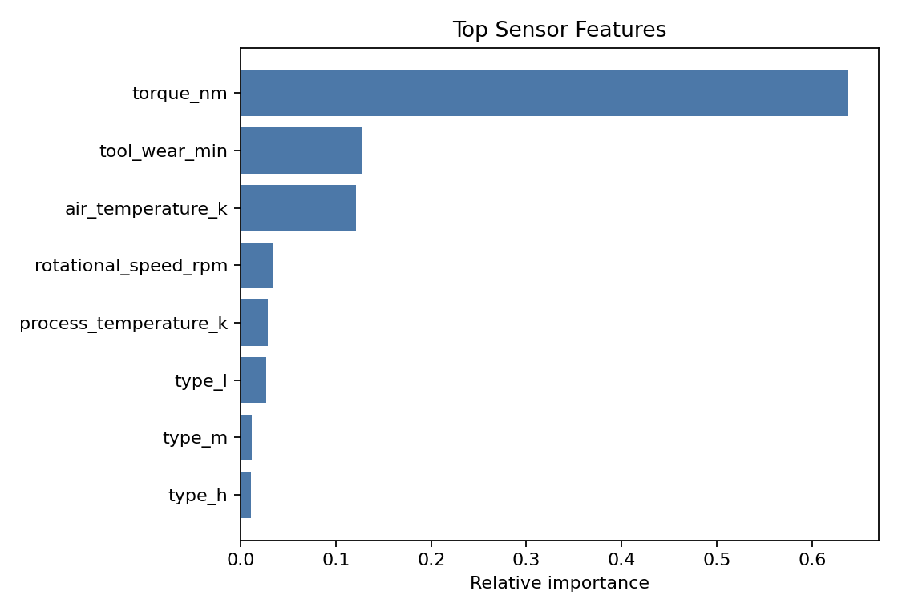
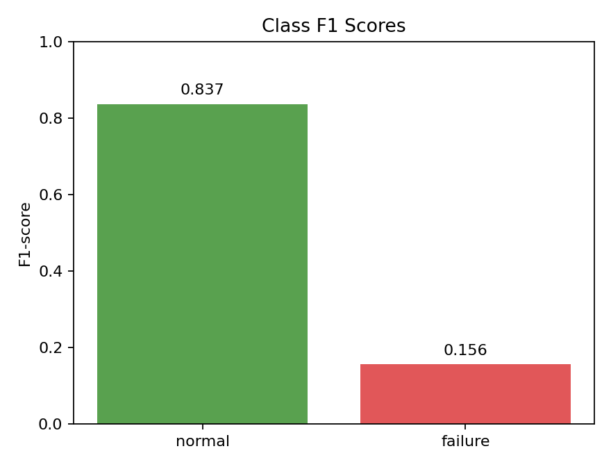
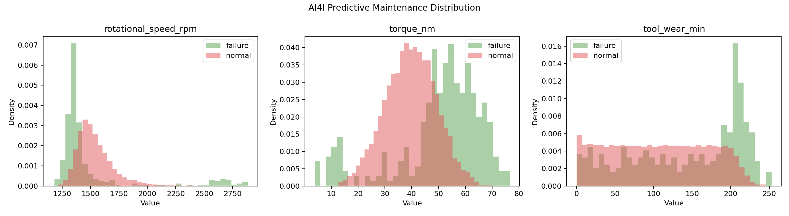

# AI4I 예지정비 분류 실험 결과

## 데이터

- 전체 행 수: 10000
- 학습 행 수: 7501
- 테스트 행 수: 2499
- 라벨 분포: normal 9661개, failure 339개
- 모델: standardized_class_centroid

## 성능

- Accuracy: 0.726
- Macro F1: 0.496

| Class | Precision | Recall | F1-score | Support |
| --- | ---: | ---: | ---: | ---: |
| normal | 0.988 | 0.725 | 0.837 | 2415 |
| failure | 0.087 | 0.750 | 0.156 | 84 |

## 해석

이 실험은 차량 데이터는 아니지만 예지정비 벤치마크로, 회전 속도와 토크, 온도, 마모 feature로 고장 여부를 분류해 정비 예측 파이프라인을 보조 검증한다.

## 시각화

