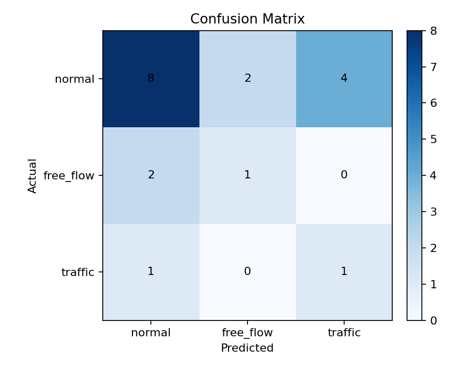
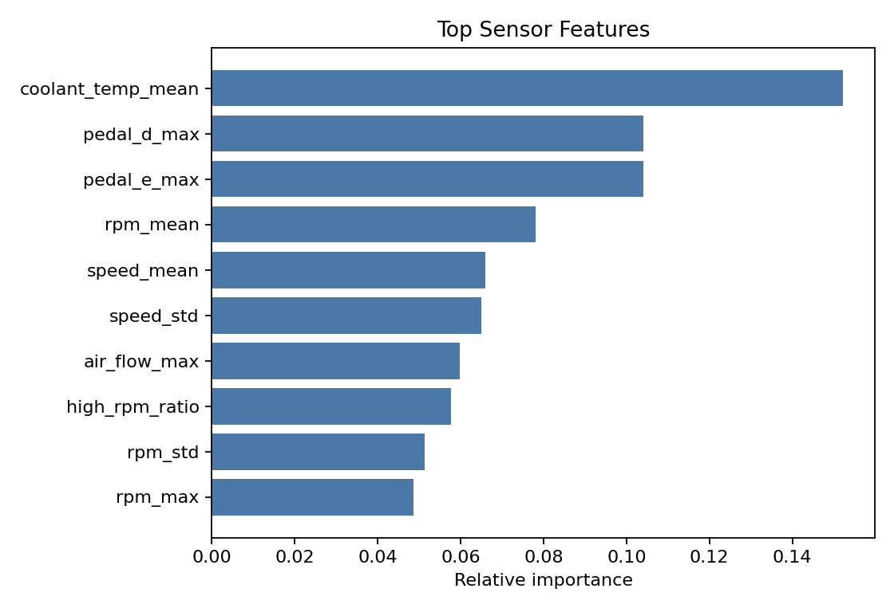
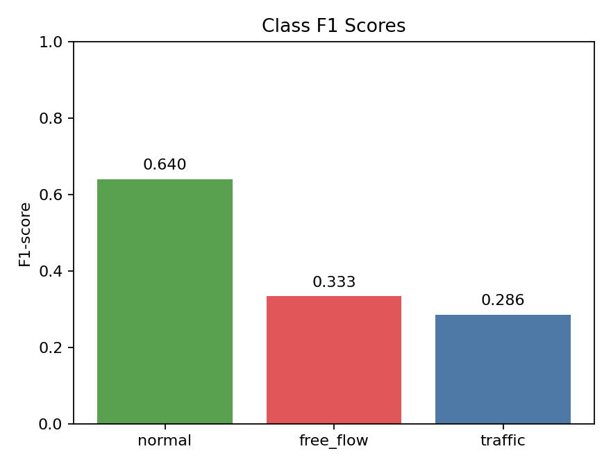
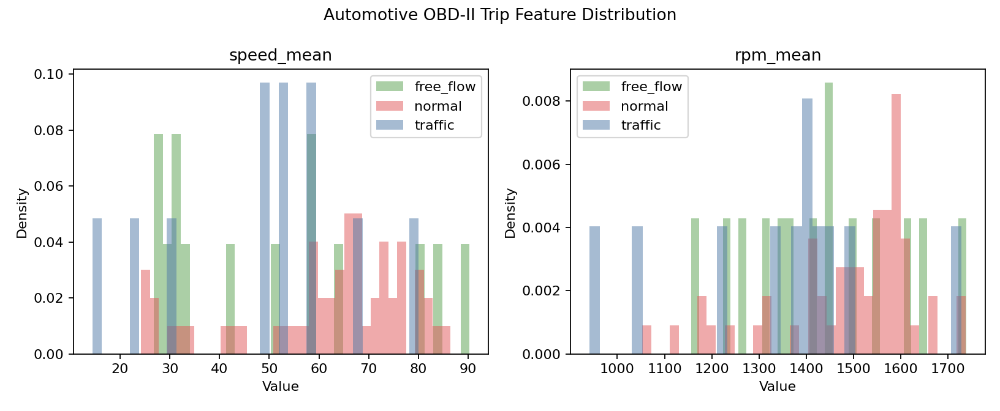

# KIT Automotive OBD-II 주행 조건 분류 실험 결과

## 데이터

- 전체 행 수: 81
- 학습 행 수: 62
- 테스트 행 수: 19
- 라벨 분포: normal 56개, free_flow 14개, traffic 11개
- 모델: standardized_class_centroid

## 성능

- Accuracy: 0.526
- Macro F1: 0.420

| Class | Precision | Recall | F1-score | Support |
| --- | ---: | ---: | ---: | ---: |
| normal | 0.727 | 0.571 | 0.640 | 14 |
| free_flow | 0.333 | 0.333 | 0.333 | 3 |
| traffic | 0.200 | 0.500 | 0.286 | 2 |

## 해석

이 실험은 실제 OBD-II 주행 로그를 trip 단위 feature로 집계하고 도로 조건을 분류한다. 차량 내부 신호를 프로젝트의 trip-level feature로 변환하는 검증 실험이다.

## 시각화

