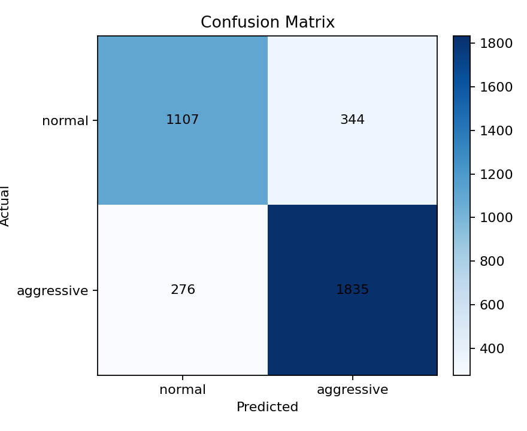
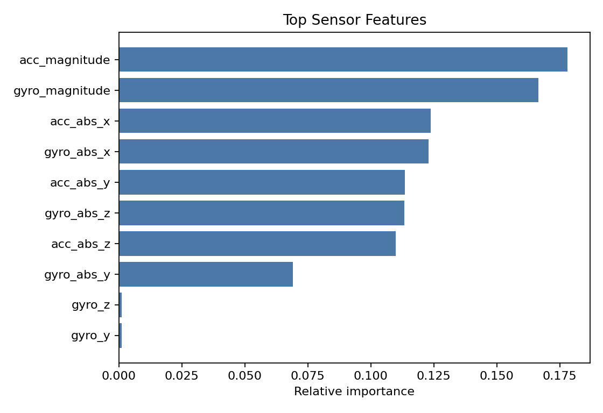
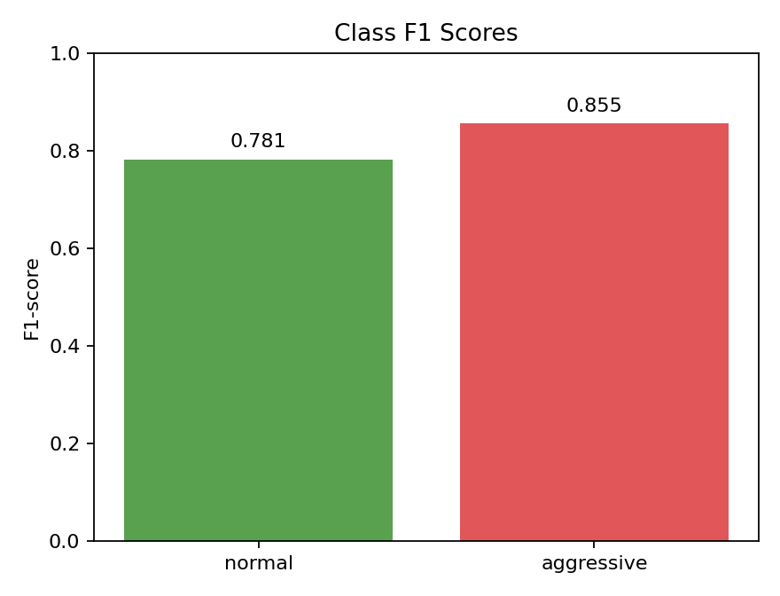
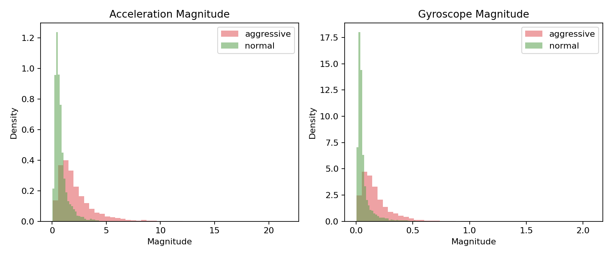

# Mendeley 운전 습관 분류 실험 결과

## 데이터

- 전체 행 수: 14249
- 학습 행 수: 10687
- 테스트 행 수: 3562
- 라벨 분포: normal 5805개, aggressive 8444개
- 모델: standardized k-NN, k=15

## 성능

- Accuracy: 0.826
- Macro F1: 0.818

| Class | Precision | Recall | F1-score | Support |
| --- | ---: | ---: | ---: | ---: |
| normal | 0.800 | 0.763 | 0.781 | 1451 |
| aggressive | 0.842 | 0.869 | 0.855 | 2111 |

## 산출 파일

- Confusion Matrix: `../outputs/mendeley_confusion_matrix.csv`
- Feature importance: `../outputs/mendeley_feature_importance.csv`

## 시각화

## 해석

이 실험은 스마트폰 가속도계와 자이로스코프 데이터만 사용해 normal/aggressive 운전 습관을 분류한다. 차량 RPM, 엔진 부하, 냉각수 온도, 배터리 전압은 이 데이터셋에 없으므로 차량 상태 이상 탐지와 점검 권장 리포트는 별도 OBD-II/CAN 또는 정비 데이터와 결합해야 한다.
