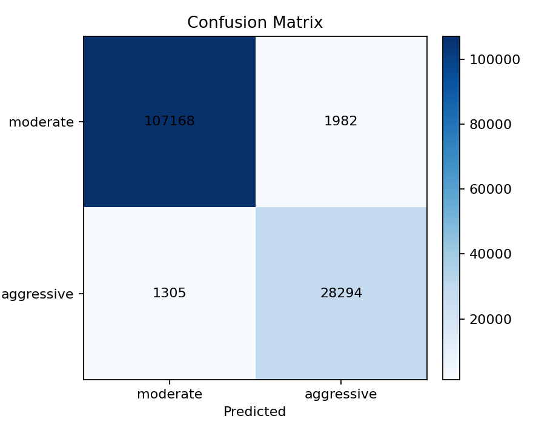
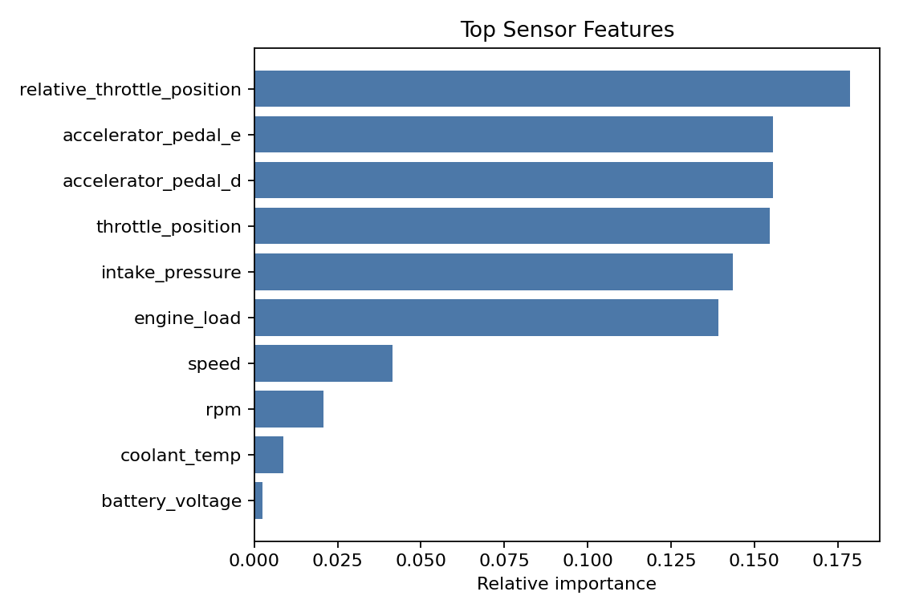
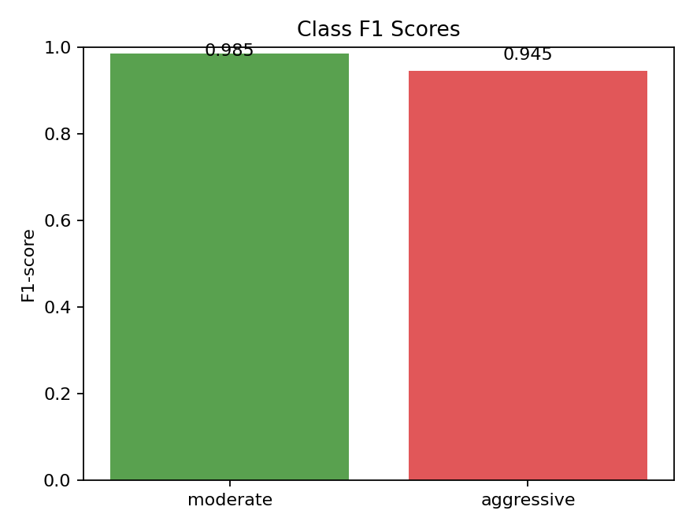
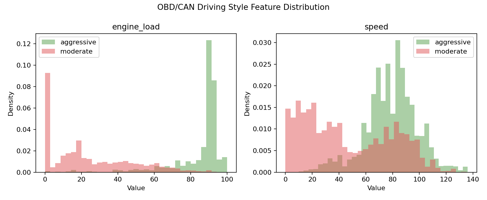

# OBD-II/CAN 운전 습관 분류 실험 결과

## 데이터

- 전체 행 수: 555000
- 학습 행 수: 416251
- 테스트 행 수: 138749
- 라벨 분포: moderate 436602개, aggressive 118398개
- 모델: standardized_class_centroid

## 성능

- Accuracy: 0.976
- Macro F1: 0.965

| Class | Precision | Recall | F1-score | Support |
| --- | ---: | ---: | ---: | ---: |
| moderate | 0.988 | 0.982 | 0.985 | 109150 |
| aggressive | 0.935 | 0.956 | 0.945 | 29599 |

## 해석

이 실험은 OBD-II/CAN 차량 내부 신호를 사용해 moderate/aggressive 주행을 분류한다. Mendeley 스마트폰 센서 실험을 차량 내부 데이터 기반 실험으로 보강한다.

## 시각화

