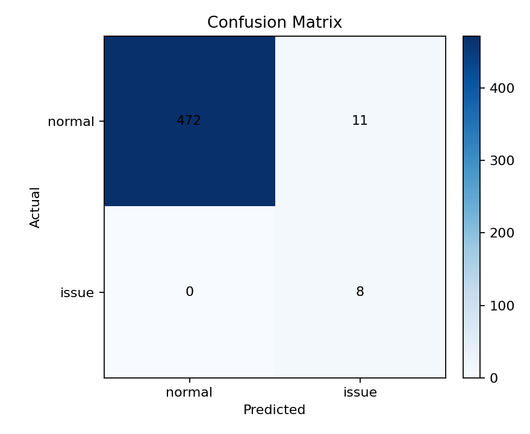
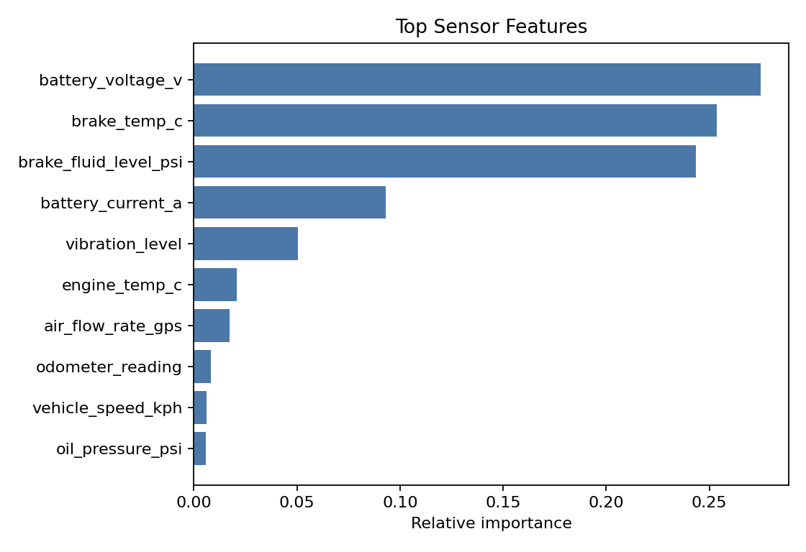
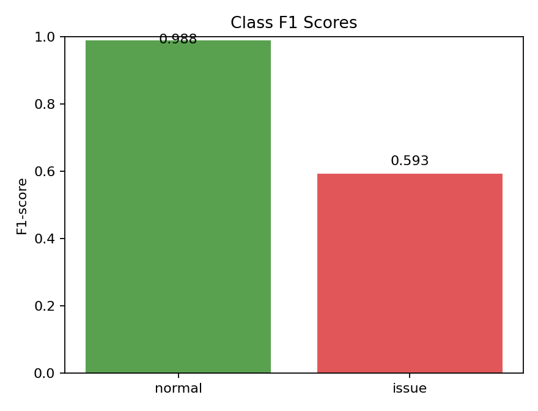
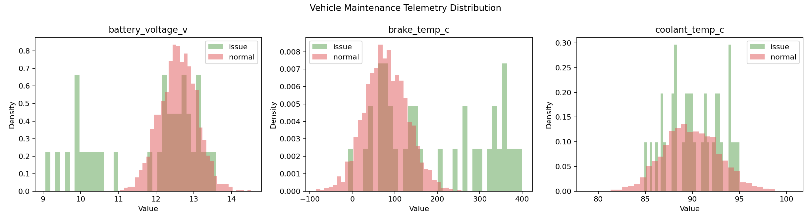

# Vehicle Maintenance 차량 상태 이상 탐지 실험 결과

## 데이터

- 전체 행 수: 1970
- 학습 행 수: 1479
- 테스트 행 수: 491
- 라벨 분포: normal 1935개, issue 35개
- 모델: robust_z_score_anomaly_detector

## 성능

- Accuracy: 0.978
- Macro F1: 0.791

| Class | Precision | Recall | F1-score | Support |
| --- | ---: | ---: | ---: | ---: |
| normal | 1.000 | 0.977 | 0.988 | 483 |
| issue | 0.421 | 1.000 | 0.593 | 8 |

## 해석

이 실험은 차량 텔레메트리에서 정상 상태 기준을 학습하고, 새 데이터가 정상 범위를 벗어나는지 robust z-score 이상 탐지로 판정한다. 고장 라벨이 매우 적어 recall과 precision을 함께 봐야 한다.

## 시각화

